# __Knowing Europe__

Knowing Europe is a simple little JavaScript trivia game with two game modes.

The first mode presents the player with the picture of a flag and three options.  
The goal is to correctly guess which country the flag blelongs to.

The second game mode presents the user with the name of a country, a picture of a city and, once again, three options.  
The goal this time is to correctly guess the name of the capitol city of the country.

In both game modes the game runs for 15 rounds.

> Visit the site and try out the game [__HERE__](https://madmaddie81.github.io/Knowing-Europe/)

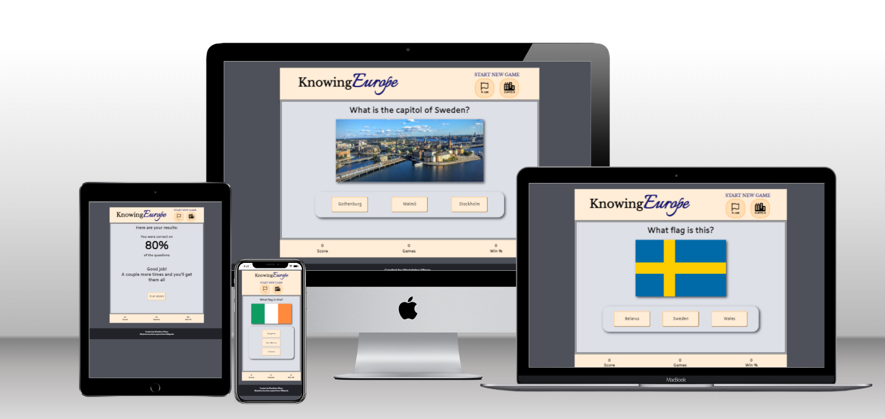

---

## __Features__

### __The Header__

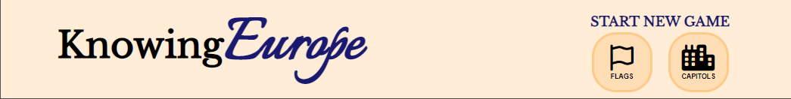

__The header has two features:__  
* The title of the game.
* The option buttons to start a new game
  - These buttons will be here through the entire game process and allows for the player to restart the game at any point.
  - On screens that allow hover effects, all buttons in this game will react on the cursor movements.

### __The Footer__

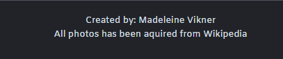

I chose to go with a very simple footer that only has two features; my name, and a disclaimer that all images comes from Wikipedia, with a link that opens in a new tab.

### __The Landing Page__

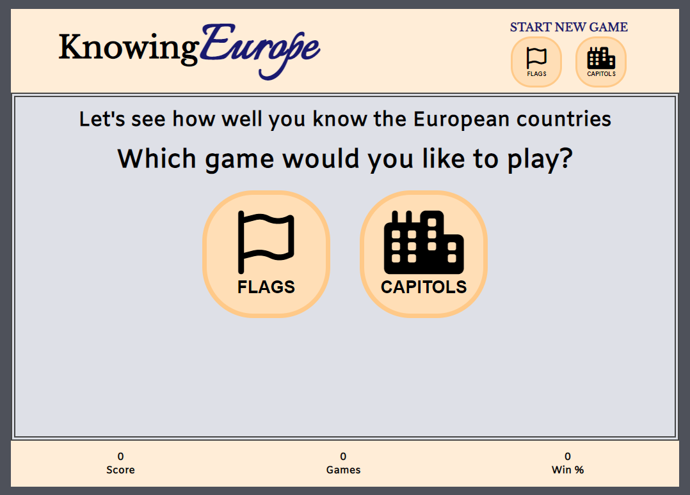

* When the player arrives to the site they are presented with two options; Flags or Capitols.  
* These buttons are larger versions of the ones in the header and are here to further entice the user to start a game.

### __The Game Explanation__

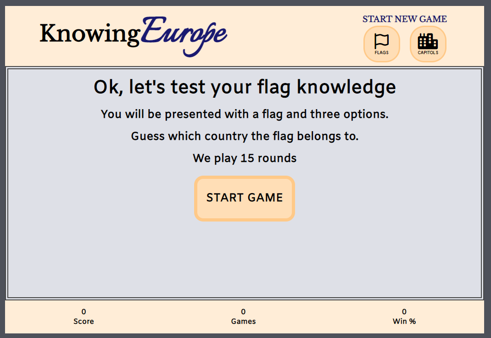

When the player has picked a game mode the are presented with a short description of the game and a button to start the game when they are ready.

### __The Flag Game__

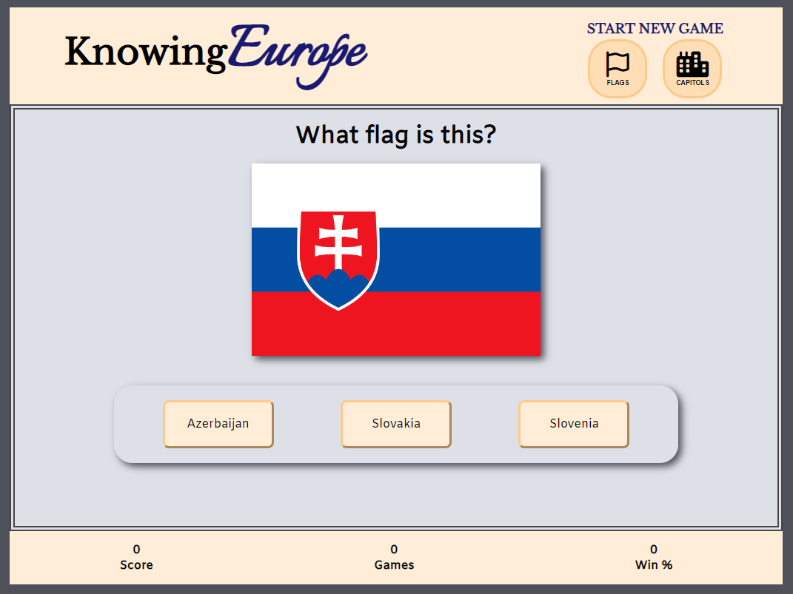

* Each round the player is presented with a new flag.
  - The same flag will not appear twice in the same game session.
* A bar with three option buttons has now appeared.
  - One of the buttons has the name of the correct answer.
  - The content of the other two buttons has been randomly generated from an array.
  - The order of the options are also randomly generated.

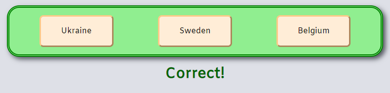

* If the player picks the right answer the bar behind the option buttons turns green and a message tells the player that they were indeed correct.

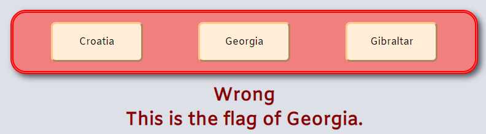

* If the user player incorrectly the bar turns red and the correct answer is displayed below.

### __The Capitols Game__

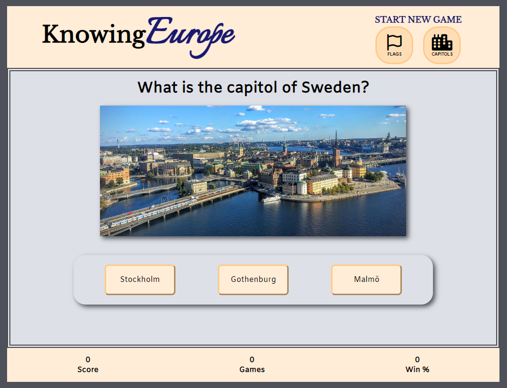

* This game mode is very simmilar to the Flags game.
* Here the player is asked the question "What is the capitol of (_country name_)?"
* A lovely picture of the city in question is presented instead of a flag.
* The options in this game mode has not been randomly generated. 
  - Instead they have been individually selected for each question, and can be the names of big cities in the same country, the capitols of neighbouring countries, or the name could just have been made up by me.
* The order of the option buttons are still randomised.
* The answering system works the same way as in the Flag game.

__In both game modes the game runs for 15 rounds.__

### __The Score Bar__

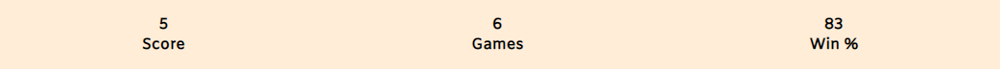

* After each game round the Score Bar is updated
* Three variables will be tracked:
  - The number of correct answers.
  - The number of played game rounds.
  - The percentage of correctly answered questions.

### __The Results__

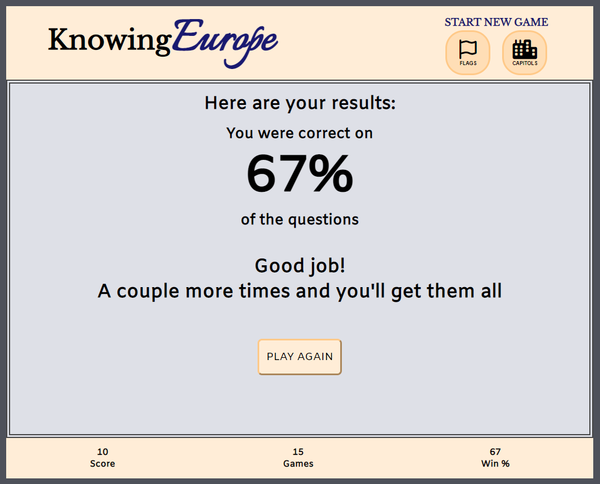

* After all 15 rounds has been played the player is presented with their results
* A button brings the player back to the very first page, so they can start over.

---

## __Design, Technologies & Deployment__

* The game was designed and written in __GitPod__, using __HTML__, __CSS__ and __JavaScript__
  - The DOM, the styling and the script are all in separate files.
* The site is hosted by __GitHub__ and was deployed to __GitHub Pages__ using the main branch.
* The favicon was created using [__favicon.io__](https://favicon.io/).
* The gamemode icons were imported from [__Font Awesome__](https://fontawesome.com/).

---

## __Accessibility__

